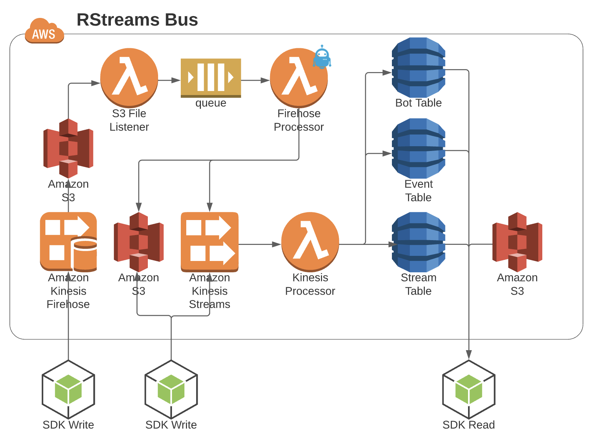






The terms defined in the [Fundamentals Article](../../rstreams-guides/core-concepts/fundamentals) may really help before reading this article.


# Summary
This article explains the mechanics of how an instance of the RStreams Bus works by looking at the operations that cause data to flow through the bus.

# What is the "Bus"?
It's an AWS-native implementation of an [event streaming](../../rstreams-guides/core-concepts/event-streaming-primer) and general purpose messaging
system built using AWS services.

## Event Streaming
The bus is a way for a client application (usually a bot) to...
* Push vast numbers of data events into a named queue quickly, typically using the Node SDK, and keep them in order
* Retrieve vast numbers of data events from a named queue quickly, retrieving them in order so they can be processed in order
* Read from one RStreams queue while simultaneously processing data already retrieved and optionally pushing that data to another queue(s)

## General Purpose Messaging
The following are the messaging models supported by the RStreams Bus:

* **Push events to consumer** : Bot will be invoked when events are pushed into a given queue and to continue pulling events from
 the queue until there are no more events or the Bot shuts down and then restarted and invoked again if/when there are more events
* **Consumer pulls events** : Bot will be invoked on a cron and pull events from a given queue
* **Consumer reduces events** : Bot will read events from a queue and aggregate/reduce them in some manner, turning N events into 1 event and
pushing the new event to another queue
* **Producer pushes to a single queue - 1 to 1** : Bot pushes data events to a single queue
* **Producer pushes to multiple queues - 1 to many** : Bot reads data events from a queue and then pushes data events to multiple queues
* **Multiple producers push to a single queue - many to 1** : Multiple bots read data from various queues and write data events to a single queue 

# The Bus Architecture Diagram

Here's a diagram of an RStreams bus.


# The Bus Architecture - 1/2 RStreams Bus is DynamoDB and S3

The RStreams Bus is mostly bookkeeping.  The three DynamoDB tables listed above - Bot Table, Event Table, Stream Table, are the workhorse
of RStreams and where the vast majority of its functionality stems from.  The Event table stores a definition of every queue in the RStreams instance.
The Bot Table stores a definition of every bot in the RStreams instance. 

A bot is code that is registered with RStreams to read from a queue or a “system”.  A “system” is a special producer of data that can have a different
icon in Botmon and can track checksums.  For example, Mongo might be a system in Botmon. Bots can read directly from Mongo since Mongo has been
registered as a supported “system.”  Additional “systems” might include ElasticSearch, MySQL, Oracle, Postgres, Redshift, MS Sql Server, etc.

The Stream table stores every event in every queue, storing either the actual payload of events gzipped or an S3 path to the file that contains
the payload of events.  Each record may contain multiple contiguous gzipped events and each S3 file referenced may contain multiple contiguous events.


## The Event Table

| Column | Datatype | Description | Example |
| --- | --- | --- | --- |
| event | string | The name of the queue this record represents.  Used as the hash key in the table. | Weather
system.es-account
InvoiceDW-error |
| archived | boolean | If true, the queue is considered archived and won’t show up in Botmon, the RStreams monitoring/debugging tool. | true | false |
| paused | boolean | If true, this queue is paused and no downstream bots will be invoked. | true | false |
| max_eid | string | The event ID of the last event (most recently added) to the queue. | z/2019/10/15/02/30/1571106651061-0014155 |
| timestamp | string | The time of the newest event added to the queue was put in the queue as time since the epoch. | 1571106662847 |

## The Bot Table
This table keeps track of every bot in the bus.  A bot is code that registers itself with the bus to read from a queue.  
Usually, that code is a lambda function, however it doesn’t have to be.  It can be code running on an EC2 instance or on Fargate
or anywhere really.  Bots automatically show up in Botmon, RStreams’ monitoring and debugging tool. Bots keep track of their checkpoints
in the queues and “systems” they read from and write to where a checkpoint is the last position read in the queue or “system.”

| Column | Datatype | Description | Example |
| --- | --- | --- | --- |
| id | string | The unique ID for this bot in the system. | weather_loader |
| archived | boolean | If true, the bot is considered archived and is hidden from Botmon. | true | false |
| checkpoints | object | Maintains the read/write checkpoints for the current read/write position for the bots upstream/downstream queues/systems. | See CheckpointObject JSON Example below. |
| checksum | object | High level checksums are a way to true-up data retrieved from a system (such as a database table) to verify periodically that all data replicated successfully through the bot to the destination queue and if not to fix it automatically. | See ChecksumObject JSON Example below. |
| description | string | Human readable text to use within Botmon | Mongo to Weather Queue Loader |
| errorCount | int | The number of consecutive errors thrown by the bot.  RStreams dramatically slows execution of a bot after ten consecutive uncaught errors thrown by a bot and alerts on the bot. This is called a “rogue” bot. | 0 |
| executionType | enum | The service to execute for this bot, one of these: lambda | fargate | sns | url | lambda |
| instances | object | Each bot may have multiple instances to support fanout - concurrent reading by multiple instances of the same lambda from an upstream queue to  keep up with the how quickly new events are dumped in the queue.  | See InstancesObject JSON Example below. |
| invokeTime | int | The last time the bot was invoked as time since the epoch. | 1645501894232 |
| lambda | object | Custom parameters to pass to each instance of a bot on invocation. | "lambda": {"settings": [{"value": 0}]},|
| lambdaName | string | The lambda function name | mongo-weather-load-data |
| name | string | Human readable name for display in Botmon | Mongo Weather Load Data |
| paused | boolean | If paused, the bot will not be invoked. | true | false |
| requested_kinesis | object | The current max positions of all queues that will cause this bot to get triggered | "requested_kinesis": {"queue:mongo-events": "z/2021/06/11/17/...000"} |
| trigger | int | Time since the epoch of the last time the bot was triggered to run | 1623432480227 |
| scheduledTrigger | int | The millisecond time of the next time the bot is allowed to run, used for backoff retries | 1614081575844 |
| time | string | If populated, this means that this bot is run on a schedule using the cron format specified.  Use this or triggers not both. | 0 */1 * * * * |
| triggers | array<str> | The list of upstream queues that that should trigger this bot to run when events arrive in those queues. Use time or triggers not both. | ["queue:weather-events”] |


```json {linenos=inline,anchorlinenos=true,lineanchors=checkpointex}
"checkpoints": {
  "read": {
    "system:mongo-weather": {
      "checkpoint": "z/2021/06/11/14/42/01/002:MT:826...0004", // eid of last read 
                                                               // event
      "ended_timestamp": 1623422523673, // millisecond timestamp of last read event
                                        // for last chunk 
      "records": 1, // number of records for the last chunk
      "source_timestamp": 1623422523673, // millisecond event source timestamp of
                                         // last read event for last chunk
      "started_timestamp": 1623422523673 // millisecond timestamp of first read
                                         // event for last chunk
    }
  },
  "write": {
    "queue:weather": {
      "checkpoint": "z/2021/06/11/14/40/1623422416226-0000000", // eid of last
                                                                // written event
      "ended_timestamp": 1623422416226,
      "records": 1,
      "source_timestamp": 1623422414001,
      "started_timestamp": 1623422416880
    }
  }
}
```

The above shows that the bot in question is reading from an upstream “system” which is named mongo-weather (it’s reading directly from 
Mongo as opposed to a queue, though it could just be reading from a queue).  It shows the event ID of the last event read from mongo-weather,
called the checkpoint.

The above also shows that the bot is writing to a queue named weather and it has the event ID of the last event written by the bot to that
queue, called the checkpoint.



```json {linenos=inline,anchorlinenos=true,lineanchors=checksumex}
{ 
  "missing":{"M":{"count":{"N":"0"}}},
  "correct":{"M":{"count":{"N":"638"}}},
  "incorrect":{"M":{"count":{"N":"0"}}},
  "percent":{"S":"100.00"}
}
```

The above shows that there were no events missing or incorrect from the 638 events it compared from data in the queue to data in
the source system this bot read from.  Note that checksums are not needed when reading from a queue to another queue.  They are 
used when reading from another system such as a database.



```json {linenos=inline,anchorlinenos=true,lineanchors=instancesex}
"instances": {
  "0": {
    "invokeTime": 1623432243253, // millisecond timestamp of invocation
    "token": 1623432242544, // invocation token
    "maxDuration": 899999, // number of milliseconds the bot is allowed to
                           // run (timeout duration)
    "requestId": "723d9f0c-7a66-4dff-9220-f2da19e3fd51", // id of the current
                                                         // invocation
    "startTime": 1623432243415, // millisecond timestamp of when the bot
                                // started running
    "status": "complete", // status of last invocation (complete|error)
}}
```

Each instance of the bot that is running is listed with its status.  This is where the invocation locks are held based on these
three states: Invoked | Running | Complete


## The Stream Table
This table keeps track of every data event in every queue in the bus.  The sequential ordering of records in DynamoDB maintains
the order of events in each queue.  This single table has all event records for all queues interleaved but a simple and highly
efficient query can collect up events sequentially in a single queue, from a single event in time to an ending event in time.
Each record in the table represents one or more contiguous events.  Each record either contains a gzipped blob of JSON lines that
is the event(s) for that record or an S3 path to the file that holds the JSON lines file that contains the data events the record references.

| Column | Datatype | Description | Example |
| --- | --- | --- | --- |
| event | string | The name of the queue the event(s) are in. | item-prod-item-entity-old-new-to-modified-item |
| gzip | string | If present, this is the payload of the event.  This may be more than one event as JSON lines.  The whole thing is gzipped. | H4sIAAAAAAAAA9WU3W7jIBCF7/sYXIcww/DnvExEHaJaik3W4G3dKO9e3DTybv9ktb3pJaAzZ858Gk6s2bEN83Udhy7zYx93/HqI+/0h+h0P6XrFVux2zCGxDYI0esXq2Pfh4HMTu+1 |
| gzipSize | int | This is the size of the gzipped string. | 404 |
| offsets | object | A JSON object that lists offsets of where the gzipped JSON lines start/end in the file for finding events quickly in the file. | [{"M":{"gzipSize":{"N":"537"},"size":{"N":"3054"},"offset":{"N":"0"},"records":{"N":"6"},"gzipOffset":{"N":"0"},"start":{"N":"0"},"end":{"N":"5"},"event":{"S":"system.es-account"}}}] |
| records | int | The number of events the entry represents. | 6 |
| s3 | object | If this entry refers to an S3 file where the payload of the events are stored, this is where that S3 file is. | {"bucket":{"S":"prodbus-leos3-17uqyaemyrrxs"},"key":{"S":"bus/system.es-account/z/2019/08/14/23/48/1565826525744-0000001.gz"}} |
| size | int | The size in bytes of the event payload. | 401 |
| start | string | The event ID of the first event this entry includes. | z/2019/08/14/23/48/1565826524436-0000188 |
| end | string | The event ID of the last event this entry includes. | z/2019/08/14/23/48/1565826524436-0000193 |
| ttl | int | Used by DynamoDB to know when to auto delete this record and send it to a lambda to archive. | 1566431324 |
| v | int | The version of the record format in DynamoDB (current is 2). | 2 |


# The Bus Architecture - Writing, the Other Half of the Diagram
Everything to the left of the three DynamoDB tables in the diagram involves getting data onto the bus, which means into a queue,
fast while maintaining total/partial ordering, as necessary.

Every time an engineer uses the RStreams Node SDK to write data into a queue, even from a bot that is reading from an upstream
queue that then turns around and writes to a downstream queue, what’s really happening is that SDK is writing to Kinesis, in one of three ways.

## Direct to Kinesis
The SDK is simply writing the events directly to Kinesis with the data event payload gzipped and embedded directly on the
event sent to Kinesis.  This is the fastest method with the lowest latency.

## Direct to Kinesis with S3 Payloads
The SDK is writing a file of one or more actual data events to S3 and then writing a Kinesis event that references back S3
file with the actual payload.  This can introduce some downstream latency when reading the S3 files.  The SDK will automatically
choose this method for a single event when it’s too big for Kinesis to accept - bigger than 1mb.  Engineers may choose this method
via code when slightly increased read latency warrants making ingestion faster due to the massive number of expected events coming
continuously.  The read penalty payed for grabbing an S3 file is pretty minimal if the S3 file has many, many events in it.  Read
performance degrades only when downstream processes have to read many S3 files to work through a relatively small number of events.
Read performance actually improves when there is a small number of very large S3 event files.  However, the stars have to align
correctly for this to make sense.  How often is so much data delivered all at once that stuffing a large number of events into an S3
file doesn’t introduce traditional batch-like waiting and latencies?  It happens but it doesn’t apply to all use cases.


The RStreams roadmap includes a task that has the SDK automatically choose to switch between Direct to Kinesis or writing to S3,
given a few heuristics by the queue, so engineers need never care about this detail.


## Kinesis by way of Kinesis Firehose
Sometimes slightly higher ingestion latency, on the order of a 90 seconds, is OK and there is so much data coming through a
single bot that batching up over this period makes sense.  Firehose makes the most sense, however, when multiple bots are feeding
data at massive scale into as single queue.  When that’s the case, Kinesis Firehose is the way to go.  Kinesis Firehose writes its
events directly to S3 for us where RStreams uses the Direct to Kinesis with S3 Payloads described above to drop a single event
into Kinesis that references the S3 file of events.



Let’s go into more detail on each of the three approaches for writing to the bus and see what RStreams is doing underneath the covers.

### Direct to Kinesis

The SDK writes one Kinesis event for each RStreams event.  RStreams will make a best effort to make sure that the event is 1mb or
less before writing the event, taking into account gzip size if it’s being used.  If it’s greater than 1mb, SDK will use the
*Direct to Kinesis with S3 Payloads* approach for that event.  AWS Kinesis Streams is a registered “system” inside of RStreams.
This means that a bot may register to read directly from Kinesis.  Each Kinesis shard, a shard in Kinesis is a way to partition
data for read and write scale, has exactly one RStreams auto-registered bot to read data events from Kinesis and write the RStreams
events to the Stream DynamoDB table - more on this Kinesis Processor Bot event later.

Remember that once the RStreams event is in the Stream DynamoDB table, it’s “in the RStreams queue”,  and the rest of the magic of
RStreams starts happening which we’ll discuss in the very next section *Data Movement through the Bus*.

### Direct to Kinesis with S3 Payloads


The SDK, either because it’s detected that the event is too big for Kinesis or because the engineer told the SDK to use S3 for
events in code, first writes the event(s) as a file to S3.  Then, it writes to Kinesis with the body of the event referencing 
the S3 file.  So, the events in Kinesis are potentially interleaved records with some being a direct RStreams JSON data event 
payload and some being a reference to an S3 file.  Note, however, that the order is preserved by kinesis regardless since each 
event is in the correct order in Kinesis and it stays that way.  Everything that happens from this point on is the same as the 
Direct to Kinesis method using the same Kinesis Processor Bot - more on the Kinesis Processor bot later.

### Kinesis by way of Kinesis Firehose


This approach introduces a little more latency, as much as, but it can be a great way to take a vast amount of data 
coming all at once that would otherwise overwhelm Kinesis Data Streams, the vanilla Kinesis, and it would start rejecting our attempts 
to push data into Kinesis because we’ve exceeded the limit on concurrent writes to Kinesis.

The SDK is told by the engineer in code to write to Kinesis Firehose instead of vanilla Kinesis Data Streams.  By default, 
Firehose batches up events and writes them to S3.  RStreams auto-registers a bot to be invoked each time a new S3 file is 
written by Firehose.  This bot, named Firehose Processor, picks up the file and writes a new S3 file for each set of events t
argeted to a different RStreams queue.  From here, the Firehose Processor uses the *Direct to Kinesis with S3 Payloads* approach 
to write one event for each S3 file to vanilla Kinesis and it flows to the Kinesis Processor and into the Stream table.

There is more detail here and we’ve come this far so... You may have noticed that in the original diagram with the entire RStreams Bus 
depicted, there was a bot named S3 File Listener.  Well, there’s actually a bot named S3 File Listener that is invoked when Firehose 
files are created that writes to a queue named `commands.s3_bus_load` that the Firehose Processor bot wakes up to handle events as they 
are pushed into that queue.  Why mention this detail?  Like many systems with clean and useful architectures, RStreams uses RStreams 
to build itself - using bots and queues at the core of its implementation.

#### Kinesis Processor Bot
RStreams auto-registers this bot to be invoked by Kinesis when new events arrive.  The bot is configured following AWS’ best practices, 
being invoked for every X events in a micro-batch or every X amount of time since the last invocation, even if the micro-batch isn’t 
filled up yet.  The bot assigns each event a unique event ID (eid), stores the event in the Stream DynamoDB table and updates state on 
the max eid found in the queue and updates checkpoints (more on checkpoints later).



# Data Movement through the Bus
Once data hits a queue, what happens?  How does it move?  How does the bot get the data from the upstream queue?
How does data flow to the downstream queue?

Bots register themselves with RStreams, indicating whether RStreams should push events to the bot when invoked or whether the bot will
pull events from the upstream queue manually itself on invocation.  During registration, bots can also designate micro-batch sizes and 
other config about how often and when to invoke bots as events arrive in the upstream queue, perhaps favoring more invocations and less 
latency at the cost of economies of scale of working on a micro-batch of events in a single invocation.  Bots can also register and tell 
RStreams that they are to be invoked on a schedule dictated by the cron statement that accompanies the registration.

When bots are invoked and have data pushed to them or they pull data from the upstream queue, it’s up to the bot what happens next.
The bot may save the data into a database or external system and that’s it, the end of the stream.  The bot may choose to use the SDK 
to write to another queue after changing the data it received from the upstream queue somehow.  Well, using the SDK to write to a 
queue is “writing to the bus” which we just went over with the three approaches that use Kinesis.  The data gets ingested through 
kinesis and makes its way into the Stream table.  Writing to the Stream DynamoDB table means “new events arrived in the queue.”
RStreams will detect this and cause any will at the appropriate time, based on bot config, invoke any registered bots since there are new 
events in the queue.


```json {linenos=inline,anchorlinenos=true,lineanchors=rseventex}
{
  "id": "id_of_bot",
  "event": "id_of_the_queue",
  "event_source_timestamp": 1614185828000, // timestamp of the initial event
  "timestamp": 1614185828000, // timestamp of this event
  "correlation_id": { // information to track what created this event
    "source": "previous_queue_id",
    "start": "z/2021/02/24/16/50/1614185855405-0000000", // first event id
                                                         // included
    "end": "", // last event id included (optional)
    "units": 1 // number of records included (optional, defaults to 1)
  },
  "eid": "z/2021/02/24/16/57/1614185855405-0000000", // Unique ID for event
  "payload": {} // your custom data
}
```